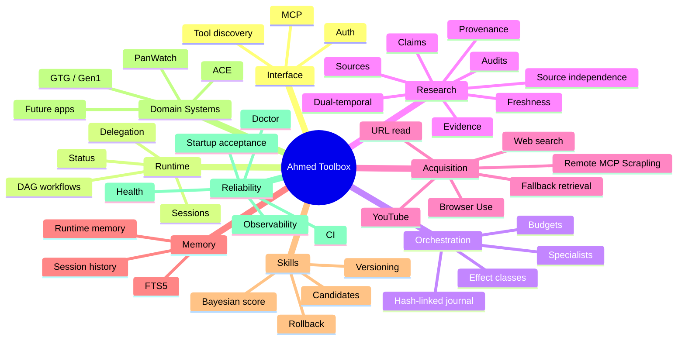
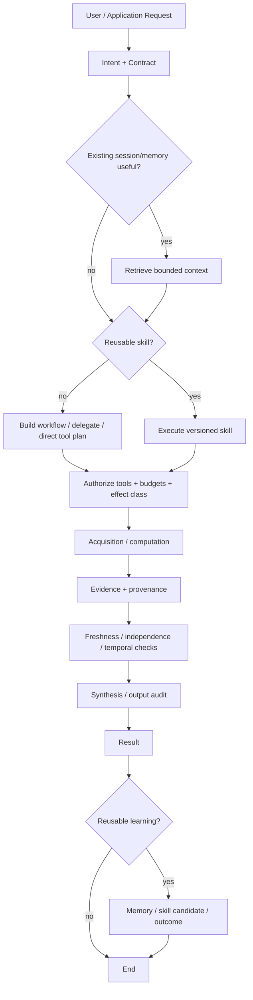
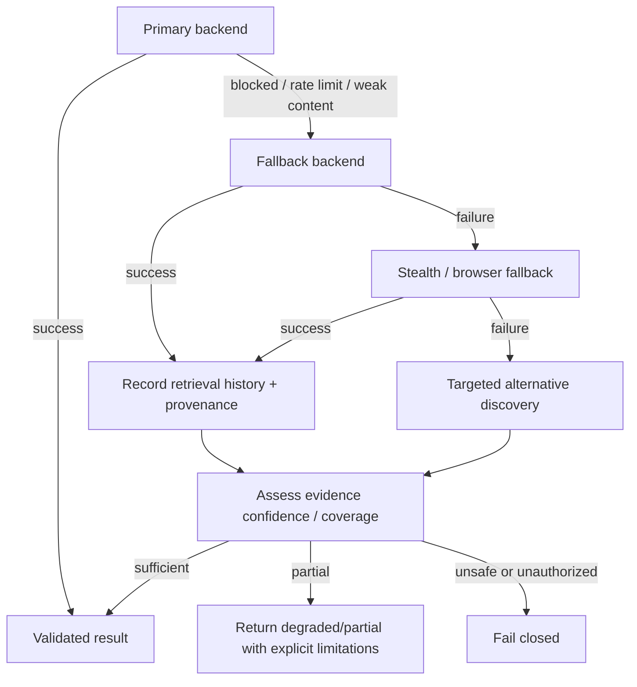
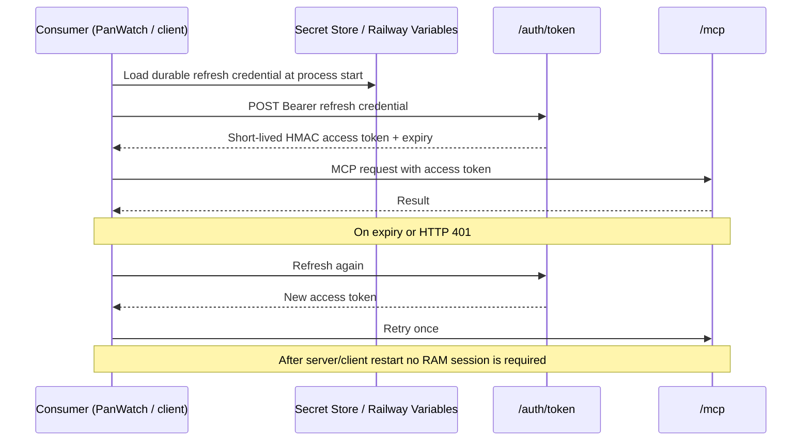
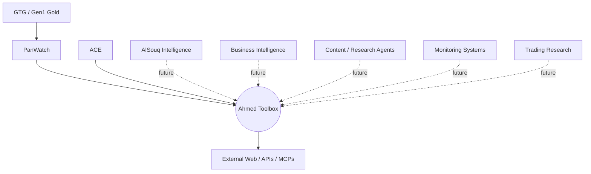
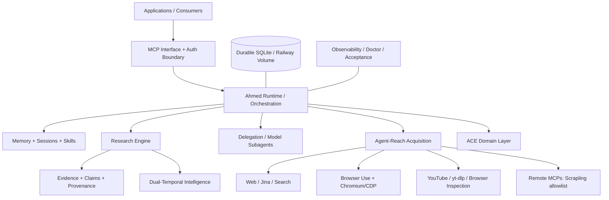
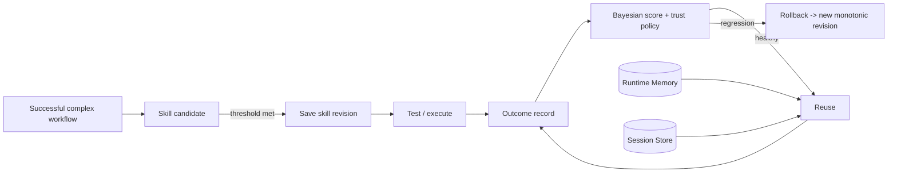
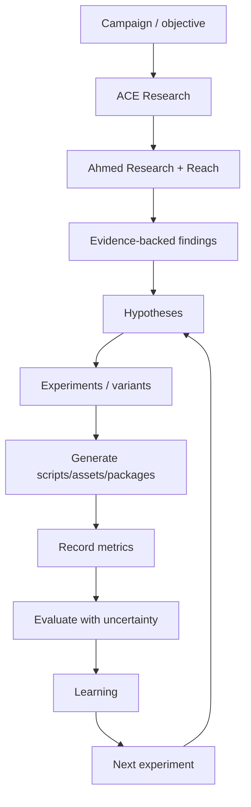

# Ahmed Toolbox

## AI Agent Infrastructure, Research Runtime & Autonomous Execution System

**Subtitle:** طبقة تشغيل ووصول وبحث وذاكرة وتنظيم للوكلاء يمكن لتطبيقات مثل PanWatch وACE وGTG وأنظمة مستقبلية الاعتماد عليها بدل إعادة بناء البنية الذكية من الصفر.

**Verification snapshot:** 2026-09-24 (Asia/Baghdad)  
**Repository:** `ahs1233/Agent-Reach`  
**Branch:** `feat/ahmed-toolbox-mcp`  
**Verified HEAD at documentation capture:** `14d42a09a1a47607e2224f11e026a694d6aa7344`  
**Verified Railway deployment:** `5a187deb-8c33-49c3-89bf-e6a3174afce1`  
**Production endpoint:** `https://agent-reach-production.up.railway.app`  
**Classification rule:** لا تُسمّى أي قدرة Production في هذه الوثيقة إلا عند وجود دليل تشغيل/CI/نشر مناسب؛ القدرات التي لم تثبت مباشرة تُصنف Stable/Beta/Experimental/Degraded/Planned.

---
## 0. Verification Baseline - ما الذي تم فحصه فعليًا؟

هذه الوثيقة ليست إعادة صياغة لوثائق قديمة. تم بناء baseline من GitHub الحالي، Railway الحالي، كود الفرع، اختبارات CI، deployment logs، tool catalog المتاح في هذه المحادثة، ومستودع PanWatch الإنتاجي.

### 0.1 نتائج التحقق الأساسية

| بند | النتيجة المثبتة |
|---|---|
| Agent-Reach repository | `ahs1233/Agent-Reach` |
| Ahmed Toolbox branch | `feat/ahmed-toolbox-mcp` |
| HEAD عند أخذ baseline | `14d42a09a1a47607e2224f11e026a694d6aa7344` |
| HEAD message | `fix: complete PanWatch refresh client imports` |
| Railway project | `reasonable-dedication` |
| Railway service | `Agent-Reach` |
| Production deployment | `5a187deb-8c33-49c3-89bf-e6a3174afce1` - SUCCESS |
| Deployment source | نفس repo، نفس branch، نفس HEAD |
| Start command | `start-ahmed-toolbox` |
| Healthcheck | `/health` |
| Runtime | Railway V2, one replica in `iad` |
| Durable volume | `agent-reach-storage`, 500 MB, mounted at `/root/.agent-reach` |
| Browser runtime | Headless Chromium + CDP `127.0.0.1:9222`, startup smoke PASS |
| Runtime startup acceptance | PASS |
| Model subagent startup acceptance | PASS |
| Dual-temporal deterministic acceptance | PASS |
| Dual-temporal live-network acceptance | PASS |
| GitHub Ahmed ToolBox CI | SUCCESS on current HEAD |
| Full regression | 858 passed, 18 skipped |
| Toolbox coverage baseline | 73.17% |
| Core stress suite | deterministic scenarios 100%; media/subagent saturation intentionally skipped in CI where external prereqs are absent |

### 0.2 ملاحظة حرجة: حالة connector في هذه المحادثة

تم استدعاء `runtime_status` و`reach_doctor` مباشرة عبر Ahmed Toolbox connector في هذه المحادثة، لكن كلاهما أعاد `UNAUTHORIZED`. وتُظهر Railway HTTP logs طلبات `POST /mcp` من عميل `openai-mcp/1.0.0` بحالة HTTP 401. لذلك لا تدعي هذه الوثيقة أن اتصال ChatGPT الحالي نجح. في المقابل، نفس deployment يشغّل runtime acceptance داخليًا بنجاح عند startup، ويشغّل `reach_doctor` داخل workflow ويكتب/يبحث memory ويشغّل skill، ما يثبت أن core runtime في الإنتاج يعمل، بينما **binding/credential الخاص بمستهلك ChatGPT الحالي هو Degraded**.

### 0.3 فرق tool surface بين Gateway وChatGPT catalog

الكتالوج المتاح لهذه المحادثة يعرض **54 أداة**. الكود الحالي للـGateway، مع الوحدات المفعلة وScrapling allowlist، يحتوي أيضًا على `reach_browser_read_url` و`toolbox_execution_stats` وخمس أدوات Dual-Temporal (`research_evaluate_temporal_validity`, `research_resolve_temporal_contradiction`, `research_temporal_fusion`, `research_final_live_refresh_gate`, `research_temporal_budget`) التي يثبت startup acceptance وجودها في Gateway، لكنها غير ظاهرة في tool catalog لهذه المحادثة. هذا يُوثَّق كـ **consumer schema/catalog lag** إلى أن يُعاد binding/discovery بنجاح.

### 0.4 معنى مستويات النضج المستخدمة

- **Production:** deployed + acceptance/CI/live evidence مناسب.
- **Stable:** implementation واختبارات جيدة، لكن evidence الإنتاجي أضيق أو الاستخدام محدود.
- **Beta:** يعمل في الكود/CI لكنه لم يثبت بعد بسيناريو إنتاجي كافٍ.
- **Experimental:** تجريبي أو غير موصى به كاعتماد حرج.
- **Degraded:** موجود لكن يوجد فشل حالي في مسار مهم.
- **Planned:** roadmap فقط ولا يُعامل كقدرة حالية.

## 1. Executive Summary

### ما هو Ahmed Toolbox؟

Ahmed Toolbox هو **AI infrastructure layer** يعمل كطبقة تشغيل وبحث ووصول وذاكرة وتنظيم فوق مصادر وأدوات متعددة وتحت تطبيقات متعددة. وظيفته ليست أن يكون «وكيلًا واحدًا ذكيًا» فحسب، بل أن يوفر للأعلى مجموعة عقود مشتركة: كيف تنفذ workflow؟ كيف تفوض subagent؟ كيف تسترجع مصدرًا مع fallback؟ كيف تحفظ evidence وprovenance؟ كيف تفرق بين المعلومة الحالية والتاريخية؟ كيف تعيد استخدام إجراء ناجح كـSkill؟ وكيف تبقى هذه الوظائف متاحة بعد restart دون جلسة RAM أو ربط يدوي؟

### لماذا بُني؟

المشكلة التي يحلها هي تكرار البنية التحتية داخل كل تطبيق. من دون طبقة مشتركة، PanWatch أو ACE أو أي نظام جديد سيحتاج كل واحد منها إلى بناء search، browser، provenance، auth، memory، retries، workflows، skills، orchestration وhealth checks من جديد. Ahmed Toolbox يجمع هذه القدرات تحت حدود موحدة وقابلة للتدقيق.

### لماذا ليس مجرد MCP Server؟

MCP هنا هو **واجهة النقل والاكتشاف**، وليس النظام كله. وراء `/mcp` توجد stores دائمة، Runtime DAG executor، Orchestration policy، Research ledger، dual-temporal engine، Browser Use runtime، remote MCP trust gateway، skill lifecycle، model subagents، ACE domain engine، وproduction acceptance. يمكن استبدال واجهة النقل مستقبلًا دون أن تختفي هذه الطبقات.

### لماذا ليس scraper؟

الـscraping مجرد backend acquisition واحد. Scrapling نفسه Remote MCP منفصل ومسموح منه allowlist read-only. النظام يستطيع أيضًا web search، Jina-style reads، Browser Use، YouTube inspection، structured research stores، model delegation. الأهم أن «الوصول» لا يساوي «الحقيقة»: ما يتم جلبه يتحول لاحقًا إلى Evidence ثم Claim ثم Output مع provenance/audits.

### لماذا ليس مجرد مجموعة tools؟

مجموعة tools لا تفرض lifecycle أو budgets أو persistence أو trust. Ahmed Toolbox يضيف execution semantics: DAG dependencies، timeouts، parallelism، effect classes، child orchestration، journals، memory/skill reuse، source independence، temporal validity، production acceptance، authentication lifecycle، observability.

### الفرق عن agent framework تقليدي

الأطر العامة مثل LangGraph أو AutoGen أو CrewAI تقدم abstractions قوية لبناء agents/workflows. Ahmed Toolbox يستخدم أفكارًا مشابهة في أجزاء معينة، لكنه مشروع خاص موجه كـ **shared service boundary** لتطبيقاتك، ويضم في نفس الخدمة acquisition + research provenance + runtime + auth + skills + app-specific domain modules. ليس هدفه استبدال كل framework، بل أن يكون infrastructure مملوكة للتطبيقات فوقها.

### النموذج الطبقي الحالي

```text
Applications / Consumers
        ↓
MCP + Authentication Boundary
        ↓
Runtime / Orchestration / Delegation
        ↓
Memory + Skills + Sessions      Research / Evidence / Provenance / Temporal
        ↓                                  ↓
Agent-Reach / Browser Use / Remote MCP Acquisition
        ↓
External Web / YouTube / Search / Structured & Public Sources
```

هذه البنية أدق من النموذج المبدئي؛ لأنها تضع auth/MCP كحد دخول، وتفصل stores/skills عن research مع بقائهما تحت Runtime، وتضع ACE كـdomain layer فوق نفس primitives لا كـacquisition backend.

## 2. System Mental Model

### 2.1 النسخة شديدة البساطة

فكر في Ahmed Toolbox كـ **الجهاز العصبي المشترك** للتطبيقات. التطبيق لا يحتاج أن يعرف أين توجد كل أداة. يقول: «أريد نتيجة يمكن الوثوق بمصدرها». الطبقة الوسطى تقرر ما إذا كانت تحتاج بحثًا، browser، workflow، specialist، memory أو skill، ثم تجمع الأدلة وتفحصها وتعيد نتيجة مع provenance وحالة ثقة/اكتمال بدل أن تعيد نصًا مجهول الأصل.

هو أيضًا يشبه **نظام تشغيل مصغر للقدرات الذكية**: ليس هو التطبيق النهائي، لكنه يملك execution kernel، persistence، drivers لمصادر خارجية، policy boundary، diagnostics، ومجموعة services يمكن لتطبيقات متعددة استدعاؤها.

### 2.2 النسخة الهندسية

عند وصول طلب، توجد أربع أسئلة متتابعة:

1. **Control plane:** ما نوع التشغيل؟ direct tool، workflow، orchestration أو delegation؟ وما حدود الأثر والميزانية؟
2. **Knowledge plane:** هل توجد memory/session/skill مفيدة؟ وهل هي سياق فقط أم دليل صالح؟
3. **Acquisition & evidence plane:** من أين نحصل على المعلومات؟ وما provenance، freshness، source independence وtemporal bucket؟
4. **Reliability plane:** ماذا يحدث إذا فشل backend أو token أو browser؟ هل نعيد المحاولة، ننتقل إلى fallback، نرجع partial، أم نفشل مغلقًا؟

النظام الحالي لا يملك Planner واحدًا يقرر كل هذه الأسئلة تلقائيًا لكل prompt بصورة عامة؛ جزء من القرار يأتي من التطبيق/الموديل/العقد الذي يستدعي أدوات Runtime. لذلك «Ahmed Toolbox يقرر كل شيء وحده» هي **رؤية مستقبلية جزئية** وليست وصفًا دقيقًا 100% للحالة الحالية. الموجود فعليًا هو primitives قوية تسمح ببناء ذلك القرار ضمن workflows وorchestration وsubagents.

## 3. Mind Maps

### 3.1 Ahmed Toolbox Master Map



### 3.2 Request Lifecycle



### 3.3 Failure & Recovery Map



### 3.4 Security / Authentication Map



### 3.5 Ecosystem Map



## 4. High-Level Architecture



الحد الأعلى Applications ليس جزءًا من Toolbox نفسه. PanWatch مستهلك مستقل وله lifecycle وdeployment وdata stores خاصة به. ACE مختلف: الكود موجود داخل Agent-Reach كـdomain layer ويتم عرضه كأدوات عبر نفس gateway، لكنه منطقيًا فوق Research/Runtime. Remote MCPs مثل Scrapling تقع أسفل trust gateway ولا تُعامل كقدرات موثوقة كاملة بشكل افتراضي.

## 5. Architecture Deep Dive

لكل طبقة أدناه: الغرض، المكونات، المدخلات، المخرجات، الفشل، التعافي، النضج، ولماذا توجد.

| Layer | Purpose / Why | Main Components | Inputs | Outputs | Failure modes | Recovery / Guards | Current maturity |
|---|---|---|---|---|---|---|---|
| A. MCP Interface | واجهة موحّدة بين المستهلك والنظام عبر JSON-RPC/MCP، مع tool discovery وtool calls. | server.py, gateway.py, auth.py | MCP initialize/list/call | نتائج tools/list وtools/call | اختلاف protocol أو 401 أو malformed JSON | Version negotiation، auth boundary، size limits | Production/Stable |
| B. Runtime | Execution Kernel لتشغيل workflows، delegation، memory، sessions، skills. | runtime.py, runtime_mcp.py | خطوات DAG / مهام / memory ops | نتيجة bounded + execution metadata | timeout، tool failure، recursive calls | timeouts، fail_fast، control-plane deny | Production |
| C. Workflow Engine | تنفيذ DAG برمجي حتى 50 خطوة مع dependencies وتوازٍ مضبوط. | execute_workflow | steps, refs, budgets | step results + status | dependency failure، timeout | max_parallel، deadline، fail_fast | Production |
| D. Orchestration | طبقة governance فوق التنفيذ: أدوار، أثر، ميزانيات، journal، authorization. | orchestration.py/mcp | objective, mode, budget | run state / verification / handoff | budget exhaustion، unauthorized tool | SE0..SE4، deny unknown، hash journal | Stable/Production |
| E. Delegation / Specialists | تقسيم العمل على specialists أو model subagents مع عزل child runs. | runtime_delegate, subagent.py | tasks, role, allowlist | bounded child results | provider failure، tool runaway | child budgets، max turns/calls، parent ceiling | Stable |
| F. Agent-Reach | طبقة acquisition الأصلية للوصول إلى المصادر؛ ليست النظام كله. | AgentReach + WebChannel + gateway reach_* | queries/URLs | raw/retrieved content + metadata | rate limit، blocked source | fallback state machine + alternate discovery | Production |
| G. Browser Use | قراءة صفحات dynamic/JS وYouTube UI عبر Chromium/CDP بصورة read-only. | browser_use.py + start script | public URL | visible text/title/comments | anti-bot، unusual traffic، timeout | SSRF guards، bounded timeout، startup smoke | Stable |
| H. Web/Search/Social Acquisition | بحث/قراءة عامة ومصادر structured وremote MCPs. | reach_web_search/read/retrieve + remote MCP | query/URL | source candidates/content | provider outage، stale content | multiple backends + provenance | Stable |
| I. YouTube Inspection | yt-dlp أولًا، Browser Use لواجهة YouTube عندما يلزم rendered UI. | reach_youtube_browser_inspect, video.py | YouTube URL | metadata/UI evidence/transcript when provider exists | login/anti-bot/STT missing | bounded comments، origin guard | Stable for browser inspection; media transcription conditional |
| J. Research Engine | تحويل الاسترجاع إلى Research Run قابل للتدقيق. | research.py/research_mcp.py | question + sources/evidence | claims/outputs/ledger | incomplete evidence، bad semantics | audits، source relationships | Production/Stable |
| K. Evidence | حفظ supporting passages وstructured facts مع observation type. | evidence_items | source + passage | evidence_id | weak/duplicate evidence | source linkage + audit | Production |
| L. Provenance | ربط كل claim/output بالمصدر ومسار الاسترجاع. | sources, retrieval_events, claim_evidence | retrieval metadata | traceable lineage | source laundering | relationships + independence evaluator | Production |
| M. Dual-Temporal Evidence | فصل LIVE/RECENT/HISTORICAL/STRUCTURAL ومنع خلط الأزمنة. | temporal.py/mcp | evidence + as_of | validity/fusion/live gate | stale current evidence | final live refresh gate + semantic guard | Production acceptance verified |
| N. Memory | ذاكرة durable bounded للمعرفة التشغيلية القابلة لإعادة الاستخدام. | runtime_memory + FTS5 | key/content/tags | ranked search results | stale memory | FTS + metadata + do-not-treat-as-evidence rule | Stable |
| O. Sessions | سجل محادثة/تشغيل قابل للبحث ضمن runtime store. | runtime_sessions + FTS5 | session messages | searchable history | context pollution | bounded storage/search | Stable |
| P. Skills | Procedural memory versioned: workflows قابلة للحفظ وإعادة التنفيذ والرجوع. | runtime_skills/versions/outcomes/candidates | workflow | revision + score/trust | poisoned/bad skill | Bayesian outcome score، failed workflow not promoted، rollback | Stable |
| Q. Model Subagents | delegated model workers عبر OpenAI-compatible endpoint. | subagent.py | objective/tools/budget | final bounded result + audit IDs | provider timeout/tool misuse | strict tool schema + child orchestration + limits | Stable; startup acceptance verified |
| R. ACE | Domain layer لتجارب المحتوى والنمو مبني فوق Research/Runtime. | ace.py/ace_mcp.py | campaign/hypothesis/metrics | experiments/learnings | causal overclaim، missing analytics | uncertainty + NEEDS_MORE_DATA states | Beta/Stable core |
| S. Authentication Lifecycle | durable refresh credential ينتج access token قصير العمر دون RAM session. | auth.py/auth_client.py | refresh credential | HMAC access token | expiry/401/restart | refresh/retry + fail-closed | Production architecture; current ChatGPT binding degraded |
| T. Production Acceptance / CI | إثبات التشغيل لا مجرد unit tests. | GitHub Actions + startup scripts | commit/deploy | pass/fail evidence | false-green CI | focused+regression+stress+startup acceptance | Production |
| U. Persistence | SQLite stores على Railway Volume مع paths configurable. | runtime/research/orchestration/ACE stores | state writes | durable DB files | volume loss/corruption | mounted volume + backups roadmap | Stable |
| V. Observability / Health | health, doctor, logs, execution stats, acceptance markers. | observability.py, reach_doctor, /health | events/time window | status/metrics/logs | silent failures | redaction + execution log store | Stable; connector catalog omits execution-stats tool |
| W. Remote MCP Trust Gateway | يمنع تمرير أي remote MCP كأنه موثوق تلقائيًا. | RemoteMCPClient + allowlists | remote tool schemas | namespaced tools | write-capable remote tool | allowlist + effect classification + explicit trust | Stable |

### 5.1 ملاحظات تصميمية مهمة

**الفصل بين Acquisition وResearch:** `reach_*` وremote MCPs تجلب أو تقرأ. `research_*` يحول المادة إلى سجل evidence/claims قابل للتدقيق. هذا يمنع خطأ معماري شائع: اعتبار نجاح HTTP أو scraper مساويًا لصحة الاستنتاج.

**الفصل بين Runtime وOrchestration:** Runtime هو المنفذ؛ Orchestration هو الحوكمة. يمكنك تشغيل workflow بسيط، لكن عند الأدوات ذات أثر أعلى أو model-backed children يصبح orchestration ID والميزانيات والجورنال جزءًا من safety contract.

**الفصل بين Memory وEvidence:** Runtime memory مفيدة لإعادة الاستخدام والسياق، لكنها ليست تلقائيًا مصدر حقيقة. البحث الحالي يملك freshness/temporal/provenance checks منفصلة، وهو ما يجب الحفاظ عليه في أي Unified Memory Fabric مستقبلي.

## 6. How Ahmed Toolbox Works - أمثلة تشغيلية

### المثال A: «حلل لي هذا الفيديو»

المسار الواقعي المحتمل اليوم هو: تحديد URL ونوع المصدر -> محاولة media/metadata path المناسب -> إذا كان YouTube وyt-dlp كافيًا فيستخدم كمسار أساسي -> إذا احتاج rendered UI أو comments ينتقل `reach_youtube_browser_inspect` إلى Browser Use/Chromium -> يسجل source/retrieval history في Research عندما يكون المطلوب بحثًا موثقًا -> يضيف evidence/claims -> يدقق output. إذا لم توجد STT provider prerequisites فإن `reach_media_ingest` يجب أن يعيد فشلًا صريحًا بدل اختلاق transcript.

### المثال B: «ابحث عن أفضل مصادر مجانية للفوليوم والفوتبرنت»

`reach_web_search` لاختيار candidates -> `reach_retrieve_url` أو `reach_read_url` لجلب المصدر -> fallback إلى Scrapling/stealth/browser عند blocking -> Research Run يسجل كل source -> evidence passages -> source independence يمنع عدّ mirrors كأنها مصادر مستقلة -> synthesis يفرق بين «مجاني»، «بيانات حقيقية»، «delayed»، «requires account» بدل دمجها.

### المثال C: «نفذ Workflow وابحث وتحقق»

`runtime_execute_workflow` يبني DAG: search branches متوازية -> read/retrieve -> research recording/verification (إذا تم تصميم workflow لذلك) -> final synthesis. Runtime يمنع داخل workflow استدعاء `runtime_*` أو `orchestration_*` كخطوة nested، ولذلك لا يستطيع workflow أن يلد control plane جديدًا بلا حدود.

### lifecycle داخلي عام

1. Request received عبر consumer/MCP.
2. Consumer/model يحدد intent وعقد التنفيذ.
3. Runtime يختار direct workflow/delegation بحسب الاستدعاء.
4. يمكن البحث في session/memory.
5. يمكن فحص Skill موجود أو candidate.
6. يتم اختيار tools ضمن allowlists/effect class/budget.
7. Acquisition عبر Reach/Search/Browser/remote MCP.
8. Evidence collection داخل Research Engine عند الحاجة.
9. Provenance يربط المصدر ومسار retrieval.
10. Freshness/independence/temporal checks.
11. Controlled fallbacks عند failure.
12. Synthesis/output creation.
13. Output audit والعودة للمستهلك.
14. إذا كان الإجراء reusable ونجح، يمكن تسجيل outcome/candidate/skill وفق policy.

**ما ليس مثبتًا كليًا:** لا يوجد دليل أن كل prompt عادي يمر تلقائيًا بكل هذه المراحل. هذه primitives متاحة، لكن التطبيق/الworkflow يجب أن يستدعيها أو يفرض contract.

## 7. Runtime - Execution Kernel

الـRuntime الحالي هو أقرب مكوّن إلى kernel. لديه durable SQLite store، workflow executor، delegation، memory/session indexes، skill store، outcomes وcandidates. وهو لا يسمح arbitrary Python داخل skill workflow؛ التنفيذ يمر عبر tools المسجلة.

| Tool | الوظيفة | Input | Output | متى تستخدم | المخاطر | الحماية |
|---|---|---|---|---|---|---|
| runtime_status | يصف capabilities وصحة durable store | {} | status/features/store health | قبل التشغيل وتشخيص baseline | قد يُضلل إذا consumer auth مكسور | لا side effects |
| runtime_execute_workflow | يشغّل DAG حتى 50 خطوة | steps, deps, refs, max_parallel, timeout | step results/status | سلاسل متعددة الأدوات | runaway/recursive graph | runtime_/orchestration_ nested deny; 900s cap |
| runtime_delegate | ينفذ حتى 12 مهمة specialist/model child | tasks, role, budgets | task outcomes + child IDs | تقسيم البحث المتوازي | provider/tool explosion | max_parallel 6; parent/child budget ceilings |
| runtime_memory_put | يحفظ memory durable | key/content/kind/tags/metadata | stored record | معرفة تشغيلية reusable | stale/untrusted facts | لا تُعامل الذاكرة وحدها كدليل |
| runtime_memory_search | بحث FTS5 مع LIKE fallback | query, limit | ranked records | استرجاع سياق سابق | false positives | bounded limit + metadata |
| runtime_session_search | بحث في history/session store | query/session_id/limit | messages | استعادة سياق تشغيل | context bleed | scoping + bounded results |
| runtime_skill_save | حفظ skill revisioned | name/description/workflow | revision | workflow معروف ومختبر | poisoning | version history + policy metadata |
| runtime_skill_list | ترتيب skills حسب observed Bayesian score | limit/filters | ranked skills | اختيار إجراء reusable | overtrust small sample | score + outcomes + trust status |
| runtime_skill_candidates | يعرض candidates المتكررة قبل promotion | filters/limit | candidate stats | auto-learning governance | accidental promotion | success/failure threshold + complexity guard |
| runtime_skill_get | قراءة skill الحالية وتاريخها | name | workflow/revision/policy | التدقيق | stale revision assumption | explicit revision state |
| runtime_skill_rollback | الرجوع وظيفيًا إلى revision أقدم | name/revision | new monotonic revision | regression recovery | losing audit trail | لا يعيد رقم revision للخلف؛ ينشئ revision جديد |
| runtime_skill_execute | تشغيل skill وتحديث outcomes | name/arguments/timeout | execution + score update | إعادة استخدام مسار مثبت | bad skill propagation | outcome accounting + timeout + orchestration option |

### حدود مثبتة

- workflow: حتى 50 خطوة.
- `max_parallel`: حتى 8 في workflow.
- workflow timeout: 1..900 ثانية.
- delegation: حتى 12 task، `max_parallel` حتى 6، timeout حتى 1800 ثانية.
- step references: يمكن حل `$step` references لمسارات نتائج الخطوات السابقة.
- nested tool names التي تبدأ `runtime_` أو `orchestration_` تُرفض في workflow validation.
- Memory/Session يستخدمان FTS5 إن توفر، مع LIKE fallback.

## 8. Workflows

Workflow Definition عبارة عن قائمة خطوات ذات `id`, `tool_name`, `arguments`, `depends_on` ودور اختياري. الخطوات المستقلة قابلة للتوازي؛ الخطوات المعتمدة تنتظر dependencies. النتائج يمكن الرجوع إليها من خطوات لاحقة.

### Sequential vs Parallel

Sequential ليس mode منفصلًا؛ ينتج طبيعيًا من dependency graph. Parallel يحدث للخطوات التي ليس بينها dependency مع احترام `max_parallel`. هذا يجعل الـworkflow deterministic في هيكله حتى لو كانت بعض الأدوات network/model-driven.

### Timeouts / Retries / Fallbacks

Runtime يفرض deadline كليًا؛ بعض الأدوات لها timeouts داخلية. retries ليست generic بلا حدود: retrieval subsystem نفسه يستخدم state machine و`MAX_RETRIEVAL_ATTEMPTS=5` وfail-fast per backend. auth client يعيد محاولة محدودة عند transport failure/401. لا يوجد دليل على circuit breaker عام production-wide، لذلك يجب عدم الادعاء بوجوده حاليًا.

### Safeguards ضد recursion/runaway

- منع `runtime_*` و`orchestration_*` كـnested workflow tools.
- effect classification `SE0..SE4` في orchestration.
- unknown effect لا يفترض safe.
- role/tool allowlists للdelegates.
- parent/child budget accounting.
- max turns/tool calls للmodel subagent.
- hash-linked event journal وunresolved authorization check.
- secret canary scanning في orchestration.
- bounded stored results/context.

## 9. Memory System

| نوع الذاكرة | الغرض | Lifetime الحالي | هل هو Evidence؟ | ملاحظات |
|---|---|---|---|---|
| Request context | بيانات الاستدعاء الحالي | عمر الطلب | لا تلقائيًا | أقصر سياق وأقل مخاطرة |
| Session memory | تاريخ جلسة قابل للبحث | durable طالما DB محفوظ | لا | مفيد لاستمرار المهمة |
| Runtime memory | معرفة تشغيلية/keyed notes | durable | لا | FTS5 + tags + metadata |
| Skill memory | إجراءات versioned | durable revisions | لا كحقيقة، نعم كإجراء | outcomes + score + rollback |
| Research store | sources/evidence/claims | durable | نعم وفق provenance/audit | هو طبقة الحقيقة البحثية |
| Application-specific | مثل PanWatch belief/research stores | يحدده التطبيق | يعتمد | يجب عدم دمجه تلقائيًا مع Runtime memory |

### ماذا يُخزّن؟

إجراءات ناجحة، mappings، context تشغيلي مستقر، نتائج workflow اللازمة لإعادة الاستخدام، metadata تشرح المصدر/الزمن.

### ماذا لا يُخزّن كحقيقة نهائية؟

سعر حي بلا timestamp، ادعاء من مصدر مجهول، secret، token، أو استنتاج model غير موثق. إن كان المحتوى factual ومتغيرًا يجب أن يُعاد التحقق من مصدر حي قبل استخدامه كدليل.

### منع الذاكرة من التحول إلى مصدر حقيقة غير موثوق

الحماية الحالية الأساسية معمارية: Research/Evidence منفصل عن runtime memory. Roadmap يجب أن يضيف TTL/freshness namespaces وسياسة revalidation قبل factual reuse.

## 10. Skills System

```text
Need detected -> Candidate -> Tested success pattern -> Saved revision -> Execute
        -> Outcome -> Bayesian score/trust -> Reuse -> Update -> Rollback when needed
```

الـskill في النظام الحالي workflow إجرائي، وليس prompt غامضًا. توجد جداول `runtime_skills`, `runtime_skill_versions`, `runtime_skill_outcomes`, `runtime_skill_candidates`. تغيير skill ينشئ revision جديدًا. Rollback لا يمحو التاريخ بل يعيد مادة revision أقدم ضمن revision monotonic جديد، ما يحافظ على audit trail.

Startup production evidence أظهر skill باسم `__startup_doctor_skill__` revision 1، successes=56، failures=0، score≈0.98276 وحالة `TRUSTED_PRODUCTION`. هذه الثقة تعني أداءً تشغيليًا ملاحظًا لهذه skill، وليست ختمًا لصحة أي معلومة factual تنتجها مستقبلًا.

الحماية من auto-learning المفرط تشمل candidate tracking و«complex task guard» الذي يمنع one-tool health checks من التحول تلقائيًا إلى skills لمجرد تكرارها. failed workflows لا يجب أن تُpromote.

## 11. Research Engine


### Raw source vs Evidence vs Claim vs Fact vs Inference vs Conclusion

- **Raw source:** صفحة/JSON/transcript تم جلبه. ليس كله ذا صلة ولا صحة متساوية.
- **Evidence:** passage أو structured fact محدد مربوط بمصدر ووقت وطريقة retrieval.
- **Claim:** جملة قابلة للتحقق يدعمها Evidence IDs.
- **Fact:** في هذه الوثيقة لا يُستخدم المصطلح إلا لو كان claim مدعومًا بصورة مناسبة ومُصنّفًا/مدققًا؛ النظام نفسه يحفظ classification بدل افتراض fact تلقائيًا.
- **Inference:** استنتاج مشتق من عدة أدلة، ويجب ألا يُقدّم كاقتباس مباشر.
- **Conclusion:** synthesis النهائي، وقد يكون conditional أو unresolved.

### Evidence Coverage

Coverage ليس مجرد عدد URLs. يجب أن يقيس نسبة assertions/claims المدعومة، وأن يمنع source laundering. Research Engine الحالي يملك source relationships وsource independence evaluator وoutput fragments/claim links؛ Roadmap يقترح KPI رسميًا لcoverage عبر golden corpus.

### Provenance

Research DB يفصل `sources`, `retrieval_events`, `evidence_items`, `claims`, `claim_evidence`, `outputs`, `output_fragments`، مع evaluations للفreshness/source independence والطبقة temporal. هذا يسمح بالعودة من conclusion إلى claim إلى evidence إلى source ومسار retrieval.

## 12. Dual-Temporal Evidence System

النظام الحالي لا يكتفي بـ«هل المصدر جديد؟»، بل يفصل أربعة lanes:

- **LIVE:** حالة آنية أو شبه آنية ويجب أن تمر Final Live Refresh Gate.
- **RECENT:** سياق قريب له max-age policy.
- **HISTORICAL:** قديم لكن صالح للحظة تاريخية محددة؛ القِدم وحده لا يجعله stale.
- **STRUCTURAL:** قواعد/مؤسسات/بنى طويلة العمر؛ يجب التأكد هل ما زالت سارية.

Production startup acceptance تحقق من FRESH للـLIVE، قبول RECENT، `HISTORICALLY_VALID`، `STRUCTURALLY_VALID`، ومنع semantic promotion غير الصالح من ACTUAL إلى MIXED. Live-network acceptance تحقق أيضًا من blocking للـstale prior-session live evidence ومن current live gate.

Budget المثبت في acceptance: 12 retrieval calls إجمالًا، 3 لكل lane، و5 fallback attempts لكل source. هذه ليست أرقام أداء؛ إنها حدود safety/cost.

## 13. Agent-Reach - Acquisition Layer

Agent-Reach هو طبقة الوصول الأساسية التي بُني فوقها Toolbox. دوره: البحث، قراءة URL، التعامل مع channels/providers وإعادة نتائج retrieval. Ahmed Toolbox أضاف فوقه gateway موحد، fallback logic، research ledger، runtime، orchestration وغيرها. لذلك وصف Agent-Reach بأنه «Ahmed Toolbox كله» غير صحيح.

### المسارات الحالية

- `reach_web_search`: discovery web route.
- `reach_read_url`: direct public page read.
- `reach_retrieve_url`: controlled fallback state machine.
- `reach_browser_read_url`: موجود في Gateway code، Browser Use read-only، لكنه غير ظاهر في connector catalog الحالي.
- `reach_youtube_browser_inspect`: rendered YouTube UI.
- `reach_media_ingest`: media/transcript manifest عند توفر provider prerequisites.
- Remote namespaced tools من Scrapling allowlist.

`reach_retrieve_url` يوثق في وصفه المسار: Jina -> Scrapling fetch -> Scrapling stealthy -> optional browser -> targeted discovery. Alternative discovery يجب أن يبقى متميزًا عن original blocked source في provenance.

## 14. Browser Use

Docker image الحالي يثبت Chromium، ويطلقه start script بـ`--headless=new` وremote debugging على loopback `127.0.0.1:9222`، profile منفصل، no-sandbox داخل الحاوية. بعد ذلك ينفذ `browser-use` smoke ويتوقف deployment إذا لم يستطع الاتصال بـCDP. Current production log أكد readiness وsmoke PASS.

### ماذا يفعل Browser ولا يفعله Search؟

Search يجد روابط/snippets. Browser Use يرى DOM/rendered state بعد JavaScript، يستطيع الانتظار لعناصر، قراءة visible text، وقراءة metadata/comments التي لا تظهر في HTTP بسيط.

### حدود أمنية

`browser_use.py` يرفض non-public HTTP(S)، local/private hostnames، وعناوين IP الخاصة حتى بعد DNS resolution، ما يقلل SSRF. YouTube inspector يقيد origin إلى YouTube ويكتشف unusual-traffic interstitial. الزمن bounded 5..120 ثانية. الوظيفة read-only ولا تُصمم لتسجيل الدخول أو mutation.

### Login / anti-bot

عدم وجود login session مقصود حاليًا. بعض الصفحات قد تكون ناقصة أو محجوبة. Browser ليس ضمانًا لتجاوز anti-bot، ويجب أن يعيد error/degraded result بدل الادعاء بالنجاح.

## 15. YouTube / Media Inspection

Start script يضيف إعداد yt-dlp لاستخدام Node JS runtime بصورة idempotent إذا كان yt-dlp وNode موجودين. Browser Use ليس بديلًا تلقائيًا لـyt-dlp؛ الكود يصف yt-dlp كمسار أساسي وBrowser UI كخيار evidence عند الحاجة.

`reach_youtube_browser_inspect` يستطيع title, description, visible_text وعينة comments bounded. code لديه E2E acceptance اختياري عبر `AHMED_TOOLBOX_BROWSER_E2E_URL`. في هذا audit، Browser/CDP smoke مؤكد، لكن لم يُنفذ E2E فيديو خارجي جديد بسبب connector 401، لذلك لا نرفع هذا الاختبار المحدد إلى verified-live لهذا snapshot.

`reach_media_ingest` يدعم provider enum `auto/groq/openai`. Dockerfile الحالي لا يثبت ffmpeg صراحةً، وRailway variable names المرئية لا تتضمن STT provider secret مخصصًا بصورة واضحة؛ لذلك media transcription مصنف Beta/conditional وليس Production verified في هذه الوثيقة.

## 16. ACE - Ahmed Content Experiment Engine

ACE موجود فعليًا في `ace.py` و`ace_mcp.py` ويعرض 10 أدوات في catalog الحالي. هو **domain layer** لا replacement للRuntime/Research. فلسفته: `Evidence -> Hypothesis -> Experiment -> Measurement -> Learning`.

### لماذا بُني؟

لتحويل البحث عن محتوى/جمهور/نمط إلى experiment قابل للقياس بدل توليد محتوى عشوائي. ACE يملك state خاصًا بالحملات، personas، hypotheses، experiments، variants، assets، publications، metric snapshots، evaluations، learnings وcost records.

### استخدام Research

`ace_research` يستطيع الاستفادة من Reach/Search/URL/YouTube وتسجيل النتائج في Research Engine. هذا مهم لأن «فكرة ترند» ليست حقيقة سببية؛ ACE يميز observation عن causal conclusion.

### Generation & publishing

يدعم scripts/captions/storyboards/thumbnail specs عبر provider abstraction. `FREE_ONLY` يمكن أن يجبر fail صريحًا بدل استخدام provider مدفوع بلا إذن. Packaging للنشر لا يعني أن النظام نشر فعليًا؛ من دون permission/API يبقى `PACKAGE_READY`.

### Evaluation

التقييم ينظر إلى retention/engagement/intent/conversion مع sample size/missing data/uncertainty، ويمكن أن ينتهي `NEEDS_MORE_DATA`. هذا سبب تصنيفه Beta/Stable core: البنية موجودة وCI يغطيها، لكن لا يوجد في هذا audit acceptance إنتاجي حديث لحملة حقيقية بمقاييس platform analytics.

## 17. PanWatch Integration

```mermaid
flowchart LR
  P[PanWatch] --> C[AhmedToolboxClient]
  C --> R[Durable refresh credential]
  R --> A[/auth/token]
  A --> AT[Short-lived access token]
  AT --> M[/mcp]
  M --> RT[Ahmed Runtime / Reach / Research]
  RT --> E[Evidence / context]
  E --> P
  C -->|401| RR[Invalidate access + refresh + retry]
  C -->|transport error| TR[Replace HTTP client + retry]
  RR --> M
  TR --> M
```

تم التحقق من مستودع PanWatch الإنتاجي نفسه، لا من نسخة integration فقط. Railway PanWatch يشغّل `ahs1233/PanWatch` على `production/panwatch-stable` عند HEAD `0ca7fac6aabf18ec5b0fb16e919e92a2c20d5696` في deployment SUCCESS. متغيرات الخدمة تتضمن `AHMED_TOOLBOX_URL`, `AHMED_TOOLBOX_REFRESH_TOKEN`, `AHMED_TOOLBOX_ACCESS_TTL_SECONDS`, `AHMED_TOOLBOX_TIMEOUT_SECONDS` بالإضافة إلى compatibility token.

### lifecycle الفعلي في client

1. يقرأ durable refresh token من environment.
2. يحول `/mcp` base إلى `/auth/token`.
3. يطلب short-lived access token ويخزن فقط access token/expiry في RAM.
4. قبل expiry بخمس ثوان تقريبًا يجدد تلقائيًا.
5. إذا عاد 401، يمسح access cache ويجدد ويعيد الطلب مرة واحدة.
6. إذا حصل `httpx.TransportError`، يغلق client ويخلق client جديدًا ويعيد الطلب، ما يعالج stale pooled connection بعد restart.
7. `ensure_initialized` يعيد MCP initialize في عمر process؛ بعد process restart سيعاد تلقائيًا من الكود.

CI test في PanWatch يحاكي 75 call: 40 قبل expiry، 35 بعد expiry، ثم simulated transport restart، ويتوقع النجاح. في Agent-Reach نفسه يوجد اختبار lifecycle 75 call + HTTP server restart مع نفس durable secrets، دون manual rebind.

### ملاحظة CI حالية

آخر commit الإنتاجي في PanWatch نُشر بنجاح على Railway، لكن workflow `Ahmed ToolBox + XAU CI` على ذلك commit فشل في `git diff --check` قبل تشغيل focused tests بسبب whitespace gate على commit الوثائقي؛ frontend نجح وبقية focused steps سُكبت. لذلك لا ننسب لذلك run نجاح integration tests؛ نعتمد على الاختبار الموجود في الكود، وسجلات deployments السابقة/الحالية، ونوصي بفصل integration canary عن diff gate غير المرتبط وظيفيًا.

## 18. Authentication Architecture


### لماذا refresh + short-lived access أفضل من static token فقط؟

- يقلل زمن صلاحية credential المستخدم في كل request.
- access token stateless HMAC-signed؛ server restart لا يحتاج إعادة بناء session map.
- durable secret يبقى في secret store/environment لا في RAM session مؤقتة.
- يمكن للclient invalidation/refresh عند 401 دون تدخل يدوي.
- fail-closed في non-loopback: server يرفض startup إذا لم توجد persistent auth credential.

### حدود حالية

Compatibility legacy token ما زال موجودًا ويمكن السماح به حسب env، لذلك endpoint لم يصل بعد إلى «refresh-only zero legacy» كسياسة نهائية. Roadmap يجب أن ينهي migration ويعطل legacy في Production بعد اكتمال كل consumers.

### public/protected endpoints

- `/health`: public عمدًا، لا يحتوي secrets.
- `/auth/token`: POST فقط ويتطلب refresh credential.
- `/mcp`: POST protected عندما production credentials configured.
- local loopback dev يمكن أن يعمل بلا auth إن لم توجد credentials؛ non-loopback يمنع هذا السيناريو.

## 19. Reliability / Hardening

### Retries

محدودة ومحددة: auth 401 once، transport retry once في clients، retrieval stages fail-fast ثم fallback. لا توجد retry storm policy عامة.

### Timeouts

Runtime/workflow/delegation/browser/subagent جميعها bounded. هذا يمنع مهمة واحدة من احتجاز executor بلا نهاية.

### Graceful degradation

Remote MCP failure في gateway لا يجب أن يسقط Agent-Reach/بقية remotes؛ gateway يتجاوز backend unavailable أثناء tool listing. Retrieval يعيد partial/degraded عند عدم كفاية evidence. PanWatch external tools تفشل soft بحيث تبقى أدواته المحلية قابلة للاستخدام.

### Process/container restart

State durable في SQLite paths على Railway volume، بينما access-token cache disposable. Chromium يبدأ من start script ويخضع smoke test.

### CI / regression / stress

Current HEAD: focused test suites ناجحة على Python 3.10/3.12، full regression `858 passed, 18 skipped`, coverage 73.17%. Stress deterministic scenarios أظهرت 100% completion في web retrieval local، 20 research runs، 50 MCP calls، 1000 evidence items، 10 parallel DAG branches. Media ingestion وsubagent saturation تخطيا stress CI لأن deterministic job لا يملك external prerequisites، وليس لأنهما فشلا.

### Historical issues المثبتة ومعالجتها

- control-plane recursion: يوجد الآن deny صريح في `validate_workflow`.
- browser/runtime initialization: start script ينتظر CDP ويجري browser-use smoke قبل بدء server.
- auth lifecycle: stateless access + durable refresh + lifecycle tests.
- production persistence: Railway volume mounted لـ`/root/.agent-reach`.

Scrapling الذي كان له مشاكل موارد في وثائق أقدم **لا يُصنف Degraded الآن**: current Railway service SUCCESS، memory ~0.325 GB من limit ~1 GB في نافذة الفحص، وlogs تعرض MCP 200 وعمليات fetch 200.

## 20. Security Model

### Secrets

القيم السرية لا تظهر في هذه الوثيقة. Railway exposes variable names فقط في هذا audit. long-lived refresh/signing secrets تأتي من environment/secret store.

### Remote MCP boundary

Scrapling allowlist الافتراضية تقتصر على `bulk_get`, `fetch`, `bulk_fetch`, `stealthy_fetch`, `bulk_stealthy_fetch`; `make_request` مستبعد لأنه يسمح POST/PUT/DELETE، وsession mutation tools مستبعدة افتراضيًا.

### Effect classes / authorization

Orchestration يعرف `SE0..SE4`; read-only reach tools مصنفة منخفضة الأثر. unknown or mutating tools لا ينبغي تمريرها كـSE0 افتراضيًا. delegates يرثون max effect ceiling من parent ولهم budgets/journal مستقل.

### SSRF / Browser safety

Browser Use يتحقق من public URL وDNS resolution ويمنع private/local targets.

### Secret canaries

Orchestration code يحتوي scan للsecret canaries ضمن policy path. Observability store يطبق redaction قبل التسجيل.

### ما يجب تحسينه

إلغاء legacy token في production، app-specific identities بدل shared credential، rate limits/quotas لكل consumer، rotation workflow، وتوثيق threat model رسمي.

## 21. Observability

الموجود فعليًا يتكون من أربعة مستويات: `/health`، `reach_doctor`، Railway logs/health/deploy status، و`ExecutionLogStore` الذي يلتف حول tool calls ويسجل timestamps/durations/status وidentifiers مثل orchestration/workflow/session، مع tool اسمه `toolbox_execution_stats` يعيد metrics secret-safe لفترة زمنية bounded. هذا tool موجود في Gateway code ومفعّل افتراضيًا عند `from_environment`، لكنه غير ظاهر في ChatGPT catalog الحالي.

| Component | Health signal | Failure symptom | Recovery |
|---|---|---|---|
| MCP server | `/health` + Railway healthcheck | deploy unhealthy / 5xx | restart policy + investigate logs |
| Auth | 401 rate + auth lifecycle canary | repeated unauthorized | refresh/rebind/rotate; validate consumer vars |
| Runtime | `runtime_status` + startup acceptance | unhealthy store/workflow | volume/store check; rollback commit |
| Reach | `reach_doctor` | backend missing/warning | provider repair/fallback |
| Browser | CDP readiness + browser-use smoke | startup abort or browser error | restart; inspect chromium log |
| Scrapling | Railway service + MCP/fetch logs | remote absent from tool list/fallback | remote restart; memory/network check |
| Research | run/output audits | audit fail/coverage gaps | re-acquire/reclassify evidence |
| Skills | outcomes/score/trust | rising failures | rollback/quarantine |
| Orchestration | verify journal + unresolved auth | incomplete/invalid journal | deny completion; inspect events |
| PanWatch consumer | tool discovery/call logs | external_tool_unavailable / 401 | refresh client + transport retry + fail-soft |

## 22. Current State Matrix

| Component | Status | Maturity | Production Tested? | Persistence | Known Limitation | Next Improvement |
|---|---|---|---|---|---|---|
| MCP Server / Gateway | Production | High | Yes | Server stateless; state in stores | ChatGPT consumer currently 401; connector catalog lags gateway surface | fix/rebind consumer auth; schema refresh |
| Runtime | Production | High | Yes - startup + CI + stress | Yes | No live call from this chat due connector 401 | external authenticated acceptance on every release |
| Workflow DAG | Production | High | Yes | workflow outcomes/session state persisted as configured | No arbitrary Python; max 50 steps | checkpoint/resume semantics |
| Orchestration | Stable | High | Yes - startup verify | Yes | single-node SQLite scaling ceiling | durable distributed journal/store |
| Model Subagents | Stable | Medium-High | Yes - startup marker OK | journal/outcomes | external provider dependency | provider SLO + cost telemetry |
| Research Engine | Production | High | Yes | Yes | quality depends on sources | golden research corpus + evidence KPIs |
| Dual-Temporal | Production | High | Yes - deterministic + live-network acceptance | Yes | not visible in current ChatGPT tool catalog | refresh connector schema; broaden domain acceptance |
| Agent-Reach Acquisition | Production | High | Yes - live temporal acquisition | retrieval events | provider/anti-bot variability | backend SLO routing |
| Scrapling Remote MCP | Stable | Medium-High | Current prod fetch 200 observed | remote service state only | separate service/session overhead | resource/circuit dashboards |
| Browser Use + Chromium/CDP | Stable | Medium-High | Startup smoke passed | browser profile ephemeral by default | anti-bot/login constraints | isolated browser pool + egress policy |
| YouTube Browser Inspection | Stable | Medium | Browser E2E is code-gated; startup browser stack passed | evidence stored if research records it | Google unusual-traffic/login | rotating accepted egress / official API options |
| Media Ingest / STT | Beta | Medium | Code + tests; no current live STT proof in this audit | manifest/evidence when successful | provider credential/ffmpeg dependency | explicit provider acceptance + media fixtures |
| Runtime Memory | Stable | High | Startup write/search passed | Yes - SQLite volume | stale memory risk | TTL/freshness/namespace policies |
| Sessions | Stable | Medium-High | CI | Yes | not a source of truth | retention policy |
| Skills | Stable | High | Startup skill successes=56 failures=0; TRUSTED_PRODUCTION marker | Yes | trust score is operational, not factual truth | promotion gates + quarantining |
| ACE | Beta | Medium | CI/code verified | Yes - ACE store | no fresh production business-metric acceptance in this audit | real campaign analytics acceptance |
| Authentication | Production / Degraded consumer | High | 75-call lifecycle tests + deployed fail-closed | refresh secret in secret store; access token stateless | ChatGPT connector presently unauthorized | repair connector credential binding and add external canary |
| Observability | Stable | Medium-High | Code/CI/logs | ExecutionLogStore | toolbox_execution_stats not in current connector catalog | dashboard + alerts + cross-service traces |
| PanWatch Integration | Production | High | Railway deployment success; auth client tests exist | PanWatch own volume/DB | latest production branch CI failure is whitespace gate on docs commit; focused tests skipped in that run | separate integration canary independent of unrelated diff gate |

## 23. System Flow Diagrams

### A. High-Level Architecture


### B. Request Execution Flow


### C. Research Flow


### D. Authentication Flow


### E. Memory / Skill Flow



### F. Failure Recovery


### G. PanWatch Integration

```mermaid
flowchart LR
  P[PanWatch] --> C[AhmedToolboxClient]
  C --> R[Durable refresh credential]
  R --> A[/auth/token]
  A --> AT[Short-lived access token]
  AT --> M[/mcp]
  M --> RT[Ahmed Runtime / Reach / Research]
  RT --> E[Evidence / context]
  E --> P
  C -->|401| RR[Invalidate access + refresh + retry]
  C -->|transport error| TR[Replace HTTP client + retry]
  RR --> M
  TR --> M
```

### H. ACE Integration



## 24. Roadmap

هذا Roadmap يبدأ من baseline المثبت ولا يفترض أن إضافة features هي الأولوية التالية. الترتيب يعطي الاستقرار والقياس أولوية قبل الاستقلالية الأعلى.

| Phase | Goal | Deliverables | Metrics / Targets | Exit Criteria | Risks | Dependencies |
|---|---|---|---|---|---|---|
| Phase 0 - Current Verified Baseline | Freeze what is real and measured. | Inventory current tool surface; baseline CI/stress; document production IDs; close connector-auth ambiguity. | 100% architecture inventory coverage; all known gaps labeled | Docs + baseline accepted; no unknown production dependency | Concurrent branch drift | Current GitHub/Railway access |
| Phase 1 - Stabilization & Hardening | Turn current feature breadth into predictable behavior. | Golden suite 75-100 representative tasks; auth canary; regression fixtures; browser/media acceptance tiers. | Workflow completion >=97%; tool success >=99% for deterministic core; auth recovery >=99.9% in canary | Two release cycles without Sev1 regression; connector 401 eliminated | Overfitting tests | Phase 0 |
| Phase 2 - Observability & Reliability | Make every failure diagnosable and measurable. | Unified trace IDs; dashboards; per-tool p50/p95; fallback reasons; alerts; run replay metadata. | >=99% executions have trace; <5 min MTTR for common failure classes | SLO dashboard and alert drills pass | Telemetry volume/cost | Phase 1 |
| Phase 3 - Autonomous Workflow Intelligence | Choose execution strategies dynamically without losing control. | Planner policy; backend health-aware routing; bounded re-planning; workflow templates. | Fallback recovery >=95%; unnecessary calls -25%; p95 within target | Planner beats static baseline on golden suite without safety regression | Planner loops | Phase 2 + evidence metrics |
| Phase 4 - Self-Improving Skills | Learn procedures conservatively from repeated successful work. | Skill quarantine; audited promotion; per-domain scores; decay; rollback automation. | Skill reuse >=30% on repeated tasks; rollback <2%; audited promotion precision >=98% | No unreviewed skill can exceed policy effect ceiling | Skill poisoning | Phase 3 |
| Phase 5 - Multi-Agent Orchestration | Scale specialist collaboration with isolation and budgets. | Role registry; parallel child scheduling; model/provider failover; conflict adjudication. | Delegated-task completion >=95%; budget violations 0 | Chaos tests and journal verification pass | Cost/latency explosion | Phase 2-4 |
| Phase 6 - Unified Knowledge / Memory Fabric | Unify episodic, procedural, research and app memory without confusing truth classes. | Namespaces; TTL; revalidation; cross-app access policies; optional vector + structured index. | Memory retrieval precision >=90% on labeled set; stale factual reuse <1% | Evidence remains authoritative over memory | Privacy/staleness | Phase 2 + policy model |
| Phase 7 - Production Agent Platform | Make Ahmed Toolbox a reusable platform service. | Tenant/app identities; quotas; Postgres; horizontal workers; SDKs; deployment templates. | 99.9% control-plane availability; zero secret leaks; successful failover drills | Two independent apps run on common platform SLO | Migration complexity | Phase 1-6 |
| Phase 8 - General AI Operating Layer | Shared intelligence infrastructure for many applications. | Capability marketplace; policy-governed autonomous routines; durable long-running jobs; standardized app contracts. | New app integration time <1 day for common capabilities | PanWatch + ACE + at least one unrelated app share the same core without forks | Over-generalization | Phase 7 |

### 24.1 Next 12 months - ترتيب تنفيذي مقترح

**0-2 أشهر:** أصلح consumer auth/catalog mismatch، ثبت golden suite، اعمل external canary لـPanWatch وChatGPT-style MCP clients، وأغلق gaps في browser/media acceptance.

**2-4 أشهر:** unified tracing، dashboards وalerts، SLOs لكل backend، benchmark evidence coverage/memory precision.

**4-7 أشهر:** planner bounded + health-aware backend selection، skill quarantine/promotion، cost budgets.

**7-10 أشهر:** Postgres/event store path، multi-worker execution، app identities/quotas، tenant isolation.

**10-12 أشهر:** onboard تطبيق ثالث مستقل عن PanWatch/ACE، وقياس زمن التكامل لإثبات قيمة Shared Intelligence Infrastructure.

## 25. Quantitative KPIs

الأرقام الحالية لا تُملأ إلا عندما يوجد measurement مباشر. الجدول التالي يفرق بين baseline المثبت وtarget مقترح.

| KPI | Current verified baseline | 12-month target | Measurement definition |
|---|---|---|---|
| Workflow Completion Rate | لا يوجد aggregate production % موثوق في هذا audit | >= 97.5% representative workflows | completed / started excluding user-cancelled |
| Tool Success Rate | stress deterministic scenarios 100% فقط، ليس fleet-wide | >= 99% core tools | successful calls / attempted by tool class |
| Evidence Coverage | لا رقم current مثبت | >= 95% auditable claims | supported output claims / auditable claims |
| Fallback Recovery Rate | لا رقم aggregate مثبت | >= 95% recoverable primary failures | recovered / eligible primary failures |
| Mean Workflow Latency | لا aggregate current | set per workflow class | start-to-final result |
| P95 Tool Latency | stress examples exist؛ لا fleet-wide | SLO per backend | p95 successful call latency |
| Memory Retrieval Precision | غير مقاس على labeled corpus | >= 90% top-k relevant | judged relevant / retrieved |
| Skill Reuse Rate | غير مقاس | >= 30% repeated eligible tasks | skill executions / eligible repeats |
| Skill Rollback Rate | غير مقاس | < 2% promoted skills/month | rolled back / promoted |
| Browser Success Rate | startup smoke PASS؛ لا page fleet % | >= 95% supported public pages | successful rendered reads / eligible |
| Research Evidence Quality | audit framework موجود؛ لا score aggregate | >= 95% pass on golden corpus | rubric + audits |
| Auth Recovery Rate | lifecycle tests pass 75-call + restart | >= 99.9% canary cycles | successful refresh/retry / forced expiry/restart events |
| Production Acceptance Rate | current Agent-Reach HEAD acceptance PASS | 100% required release gates | releases passing mandatory gates |
| Connector Catalog Parity | current 54 visible vs ~61 expected gateway surface | 100% intended exposed tools | consumer catalog / approved gateway surface |

## 26. Risks

| Risk | Probability | Impact | Current Mitigation | Future Mitigation |
|---|---|---|---|---|
| Tool explosion | Medium | High | namespaces, allowlists, deferred exposure in PanWatch | capability registry + dynamic retrieval of schemas; hide low-value tools by default |
| Recursive agents/control plane | Low-Medium | Critical | workflow rejects nested runtime_/orchestration_; budgets | formal recursion invariant tests across all new control tools |
| Hallucinated evidence | Medium | Critical | evidence/claim separation, audits, provenance | claim verifier benchmark + mandatory citation coverage thresholds |
| Stale memory | Medium | High | memory is separate from evidence; temporal checks on research | memory TTL/freshness metadata + revalidation before factual use |
| Skill poisoning | Medium | High | candidate threshold, failed workflows not promoted, version/rollback, Bayesian score | quarantine, signed skill provenance, promotion policy requiring audited outcomes |
| Silent fallback | Medium | High | retrieval_history and explicit degraded states | fallback telemetry surfaced in every result contract |
| Browser anti-bot | High | Medium-High | Jina/Scrapling/browser alternatives; bounded failure | official APIs where possible; browser pool/egress diagnostics |
| Credential lifecycle | Medium | Critical | durable refresh + short-lived access + fail-closed | automated consumer credential rotation/canary; eliminate legacy static token |
| Vendor dependency | Medium | High | OpenAI-compatible subagents; multi-backend acquisition | provider abstraction, failover SLO, offline deterministic paths |
| Timeout cascades | Medium | High | per-workflow/delegation/tool caps | deadline propagation + circuit breaker + hedged reads selectively |
| Orchestration complexity | Medium | High | effect classes, budgets, child isolation, journal | policy DSL/tests + visualization of run graph |
| Latency | Medium-High | Medium | parallel DAG, deferred tools | p95 budgets per stage + cache/evidence reuse |
| Token/model cost | Medium | Medium-High | max turns/tool calls and bounded context | cost telemetry per run/skill/app + budget enforcement |
| Observability gaps | Medium | High | execution log store, Railway/GitHub logs | single trace ID across consumer->toolbox->remote backend |
| External API failure | High | Medium-High | fallback chain + graceful degradation | backend health scoring/circuit state + stale-if-error policies where safe |
| SQLite scaling / single replica | Medium | High at scale | Railway volume and one replica keep current consistency simple | PostgreSQL/event store migration before horizontal runtime scaling |

## 27. Competitive Positioning - Architectural, not marketing

هذه المقارنة تصف concepts موثقة علنًا حتى 2026-09-24 ولا تعطي ترتيب «أفضل/أسوأ».

| System / concept | What it emphasizes | Similarity to Ahmed Toolbox | Important difference |
|---|---|---|---|
| LangGraph | low-level orchestration، durable execution، persistence، human-in-the-loop | DAG/stateful orchestration وlong-running workflows | LangGraph إطار عام؛ Ahmed Toolbox يجمع أيضًا acquisition/research provenance/auth/domain services كخدمة مملوكة |
| AutoGen | AgentChat + event-driven Core runtime للمulti-agent systems | agents/runtime/delegation/memory/tooling | AutoGen framework عام وقابل للتوزيع؛ Ahmed Toolbox الحالي أكثر opinionated حول evidence/provenance وsingle-service gateway |
| CrewAI | Crews للcollaboration وFlows للstructured stateful workflows | specialists + sequential/parallel flow | CrewAI يركز agent teams/flows؛ Ahmed يضيف research ledger/temporal/auth gateway وremote MCP trust كجزء أصيل |
| Hermes Agent | self-improving agent، persistent memory، skills، subagents، MCP | skills/memory/delegation وأفكار selective learning | Ahmed Toolbox لم يvendor Hermes runtime؛ دمج أفكار انتقائية مع invariants الخاصة به، ويعمل كshared backend لتطبيقات متعددة |
| OpenAI Agents SDK | agents, tools, handoffs, guardrails, tracing | delegation/tool calls/tracing concepts | SDK lightweight app framework؛ Ahmed Toolbox خدمة مستمرة مع custom stores/research/acquisition/auth |
| Browser agents | UI interaction/rendered pages | Browser Use/CDP | Ahmed Browser layer read-only ومقيدة وتحت fallback/provenance، وليست وكيل browser حرًا افتراضيًا |
| MCP server | standard tools/resources/prompts interface | `/mcp`, tools/list/call | MCP يحدد interface؛ Ahmed Toolbox يضع execution/research/memory/orchestration وراء الواجهة |

### 27.1 References

- LangGraph official/maintainer docs describe it as an orchestration runtime focused on durable execution, persistence, streaming and human-in-the-loop.
- AutoGen docs distinguish AgentChat from an event-driven Core agent runtime and include teams/GraphFlow/memory.
- CrewAI docs distinguish autonomous Crews from structured Flows with state/persistence.
- OpenAI Agents SDK documents agents, handoffs/agents-as-tools, guardrails and built-in tracing.
- MCP official docs define servers around tools/resources/prompts and client/server protocol.
- Hermes Agent current docs describe persistent memory, skills, subagents, MCP and self-improving learning loops.

لا يوجد benchmark في هذا audit يسمح بقول إن Ahmed Toolbox أسرع أو أذكى أو «أفضل» من هذه المشاريع. قيمته الخاصة حاليًا هي **تركيب هذه الوظائف حول احتياجات التطبيقات الخاصة مع evidence/provenance وproduction controls موحدة**.

## 28. Future Vision - Shared Intelligence Infrastructure

الرؤية الصحيحة ليست أن يصبح Ahmed Toolbox تطبيقًا ضخمًا يفعل كل شيء، بل أن يصبح **طبقة مشتركة** تجعل كل تطبيق جديد صغيرًا في الجزء المتكرر وكبيرًا فقط في domain logic الخاص به.

```text
PanWatch / GTG          ACE             AlSouq Intelligence       Future Agents
      \                   |                    /                       /
       \__________________|___________________/_______________________/
                          |
                   Ahmed Toolbox
       Runtime + Research + Reach + Auth + Memory + Skills + Orchestration
                          |
             Web / Browser / APIs / Remote MCPs
```

الشرط حتى تكون هذه الرؤية سليمة: عدم السماح للطبقة المشتركة بأن تصبح monolith غير قابل للضبط. يجب فصل domain modules، وضع app identities وquotas، versioned contracts، ومقاييس تكلفة/latency/quality.

## 29. One-Page Summary

### What it is
Ahmed Toolbox هو AI agent infrastructure service موحد يجمع MCP access، execution runtime، orchestration، web/browser acquisition، research evidence/provenance، dual-temporal validation، memory، skills، model subagents وACE.

### How it works
Consumer يتصل عبر auth-protected MCP. الطلب يمكن أن يصبح tool call أو DAG workflow أو delegated child. الوصول للمصادر يمر عبر Agent-Reach/Browser/remote MCPs. عندما يكون الهدف بحثيًا، تتحول المصادر إلى evidence وclaims وتخضع freshness/source-independence/temporal checks ثم output audit. knowledge الإجرائية يمكن حفظها كskills versioned.

### Core architecture
Applications -> MCP/Auth -> Runtime/Orchestration -> Research/Memory/Skills -> Acquisition -> External Sources. ACE domain layer مبني فوق Research/Runtime. PanWatch مستهلك خارجي يملك auto-refresh client.

### Main capabilities
DAG workflows، parallel delegation، durable memory، session search، versioned skills/rollback، evidence ledger، provenance، source independence، dual-temporal intelligence، browser/YouTube inspection، remote MCP allowlisting، model subagents، ACE، production acceptance.

### Current maturity
Agent-Reach production deployment SUCCESS على HEAD `14d42a09...`; CI/full regression PASS؛ Browser/CDP + Runtime + Dual-Temporal startup acceptance PASS؛ live temporal acceptance PASS؛ Scrapling production healthy. Authentication architecture production-grade design/tests، لكن ChatGPT connector في هذا audit يعيد 401 ويحتاج repair/rebinding. ACE Beta/Stable core. Media STT conditional.

### Why it matters
بدل أن يعيد كل تطبيق بناء search/browser/auth/evidence/workflows/memory/skills، يمكنه استهلاك طبقة واحدة لها governance وpersistence وproduction verification.

### Next 12 months
أولوية 1: connector auth/catalog parity وgolden tests. ثم unified observability/SLOs. بعد ذلك planner bounded، skill promotion governance، multi-agent scaling وPostgres/app identities. النجاح النهائي يُقاس بإضافة تطبيق ثالث مستقل بسرعة دون fork للبنية الأساسية.

## 30. Glossary

| Term | Definition |
|---|---|
| Runtime | Execution Kernel الذي ينفذ workflows/delegation ويصل إلى stores. |
| Workflow | DAG محدد من tool steps وdependencies وarguments. |
| Orchestration | طبقة governance التي تضيف roles/effect classes/budgets/journal/authorization. |
| Delegation | إسناد tasks إلى specialists أو model-backed child agents. |
| Agent | كيان model-driven أو deterministic ينفذ هدفًا ضمن tools/policy. |
| Skill | workflow إجرائي versioned محفوظ لإعادة الاستخدام. |
| Memory | سياق durable قابل للاسترجاع؛ ليس evidence تلقائيًا. |
| Session | سجل رسائل/أحداث runtime مرتبط بمعرف جلسة. |
| Evidence | قطعة دعم محددة مرتبطة بمصدر وprovenance. |
| Claim | assertion قابل للتحقق ومدعوم بـevidence IDs. |
| Provenance | سلسلة الأصل: المصدر، retrieval، evidence، claim، output. |
| Fallback | انتقال مضبوط إلى backend/طريقة أخرى بعد فشل مصنف. |
| Browser Use | integration لقراءة UI rendered عبر Chromium/CDP بصورة read-only. |
| MCP | Model Context Protocol؛ واجهة معيارية لاكتشاف واستدعاء tools/resources/prompts. |
| Refresh Token/Credential | secret طويل العمر نسبيًا محفوظ في secret store ويستخدم فقط للحصول على access token. |
| Access Token | credential قصير العمر HMAC-signed يرسل مع `/mcp`. |
| ACE | Ahmed Content Experiment Engine؛ domain layer لتجارب المحتوى والنمو. |
| Agent-Reach | acquisition foundation الذي يوفر الوصول/search/read channels تحت Ahmed Toolbox. |
| Dual-Temporal | نظام يميز LIVE/RECENT/HISTORICAL/STRUCTURAL ويمنع stale/mixed-time reasoning. |
| Effect Class | SE0..SE4 لتصنيف أثر tool ضمن orchestration policy. |
| Production Acceptance | اختبارات/markers تشغيلية على deployment، لا unit tests فقط. |

## 31. Verified Tool Inventory

### 31.1 الأدوات الظاهرة فعليًا في ChatGPT connector catalog (54)

**Reach/Acquisition (6):** `reach_doctor`, `reach_web_search`, `reach_youtube_browser_inspect`, `reach_media_ingest`, `reach_retrieve_url`, `reach_read_url`.

**Research (15):** `research_start_run`, `research_record_source`, `research_record_source_relationship`, `research_add_evidence`, `research_add_claim`, `research_create_output`, `research_get_output`, `research_audit_output`, `research_evaluate_source_independence`, `research_get_source_independence`, `research_evaluate_freshness`, `research_get_freshness`, `research_export_ledger`, `research_audit_run`, `research_complete_run`.

**Orchestration (6):** `orchestration_start`, `orchestration_status`, `orchestration_execute`, `orchestration_verify`, `orchestration_handoff`, `orchestration_complete`.

**Runtime (12):** `runtime_status`, `runtime_execute_workflow`, `runtime_delegate`, `runtime_memory_put`, `runtime_memory_search`, `runtime_session_search`, `runtime_skill_save`, `runtime_skill_list`, `runtime_skill_candidates`, `runtime_skill_get`, `runtime_skill_rollback`, `runtime_skill_execute`.

**ACE (10):** `ace_status`, `ace_create_campaign`, `ace_research`, `ace_generate`, `ace_record_metrics`, `ace_evaluate`, `ace_learn`, `ace_next`, `ace_report`, `ace_case_study`.

**Remote Scrapling allowlist (5):** `scrapling__bulk_get`, `scrapling__fetch`, `scrapling__bulk_fetch`, `scrapling__stealthy_fetch`, `scrapling__bulk_stealthy_fetch`.

### 31.2 موجودة في current Gateway code / production acceptance لكن غائبة عن current ChatGPT catalog

- `reach_browser_read_url`
- `toolbox_execution_stats`
- `research_evaluate_temporal_validity`
- `research_resolve_temporal_contradiction`
- `research_temporal_fusion`
- `research_final_live_refresh_gate`
- `research_temporal_budget`

هذه ليست Planned: هي موجودة في code؛ temporal tools تحديدًا مطلوبة وتُستدعى في startup acceptance الحالي. لكن بسبب 401 الحالي لا يمكن تنفيذ authenticated live `tools/list` من هذه المحادثة لتحديد سبب mismatch بصورة نهائية.

## 32. Production Evidence Appendix

### Current Agent-Reach CI

- Ahmed ToolBox CI: success.
- Python 3.10 focused jobs: success.
- Python 3.12 focused jobs: success.
- Full regression: `858 passed, 18 skipped`.
- Coverage: `73.17%`.
- Core stress: deterministic scenarios PASS; external-prerequisite cases explicitly SKIP.

### Current Railway startup evidence

Markers observed include:

- `Ahmed ToolBox browser runtime ready at http://127.0.0.1:9222`
- `Ahmed ToolBox Browser Use CLI/CDP smoke test passed`
- `__AHMED_MODEL_SUBAGENT_STARTUP_ACCEPTANCE__ok`
- `__AHMED_RUNTIME_STARTUP_ACCEPTANCE__ok`
- runtime skill state: revision 1 / successes 56 / failures 0 / `TRUSTED_PRODUCTION`
- Dual-temporal startup acceptance: LIVE FRESH, HISTORICAL HISTORICALLY_VALID, STRUCTURAL STRUCTURALLY_VALID, live gate PASSED, semantic guard rejection tested, output/run audits true.
- Dual-temporal live-network acceptance: PASSED.

### Current Scrapling evidence

Service deployment SUCCESS; current logs show MCP 200/202 and fetched 200 examples. Resource metrics during audit: memory around 0.325 GB vs ~1.0 GB limit, low CPU.

### Current known defect / integration gap

ChatGPT connector -> Agent-Reach `/mcp` currently returns HTTP 401. This is the top immediate integration issue despite healthy server startup. Fixing it requires aligning the consumer's durable credential/binding with current server auth and refreshing tool discovery; the cause should not be declared definitively until that binding is inspected.

## 33. External Architectural References

هذه المصادر استُخدمت فقط للمقارنة المفاهيمية، لا لإثبات Ahmed Toolbox نفسه:

- LangGraph documentation / reference: orchestration runtime، durable execution، persistence، human-in-the-loop.
- Microsoft AutoGen documentation: AgentChat، Core agent runtime، event-driven multi-agent systems، GraphFlow/memory.
- CrewAI documentation: Crews + structured Flows/state/persistence.
- OpenAI Agents SDK documentation: agents، tools/handoffs، guardrails، tracing.
- Model Context Protocol documentation: client/server model and tools/resources/prompts.
- Nous Research Hermes Agent documentation: persistent memory، skills، subagents، MCP and learning loop.

تاريخ المقارنة: 2026-09-24. لأن هذه المشاريع سريعة التغير، يجب إعادة التحقق قبل أي قرار تقني كبير مبني على feature parity.

### 33.1 Official reference links used for architectural comparison

- LangGraph: https://docs.langchain.com/oss/python/langgraph/overview
- Microsoft AutoGen: https://microsoft.github.io/autogen/stable/
- CrewAI: https://docs.crewai.com/
- OpenAI Agents SDK: https://openai.github.io/openai-agents-python/
- Model Context Protocol: https://modelcontextprotocol.io/
- Nous Research Hermes Agent: https://github.com/NousResearch/hermes-agent
