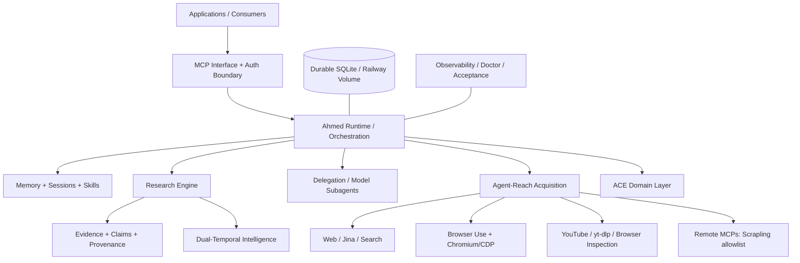
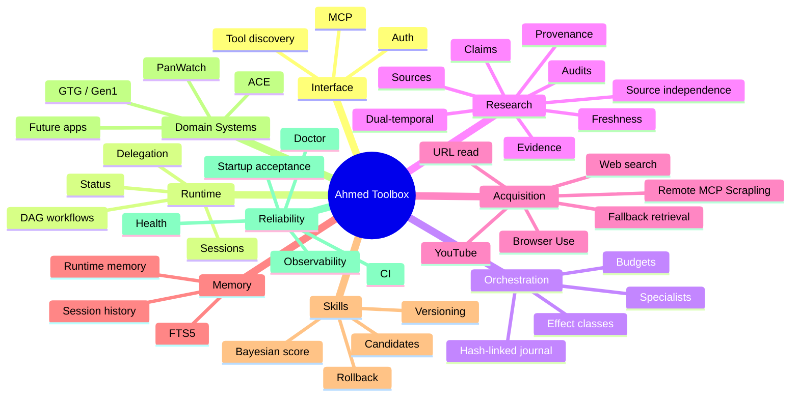
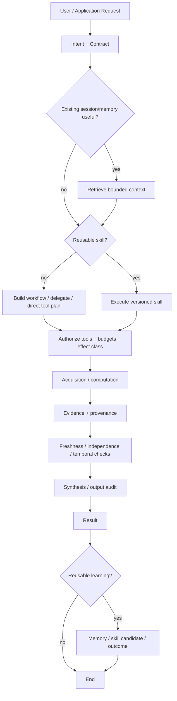
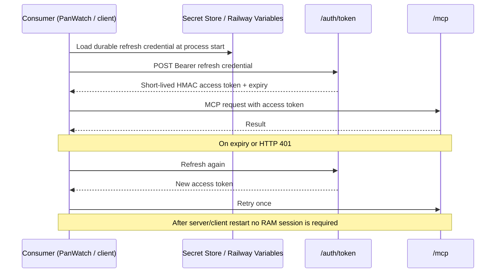
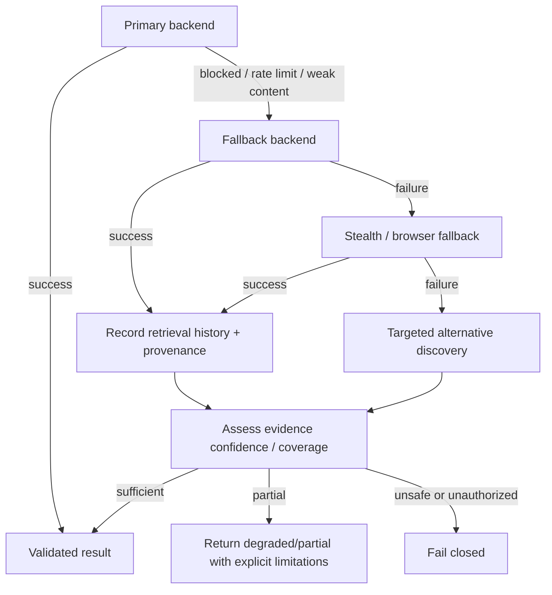
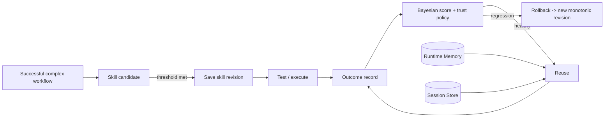
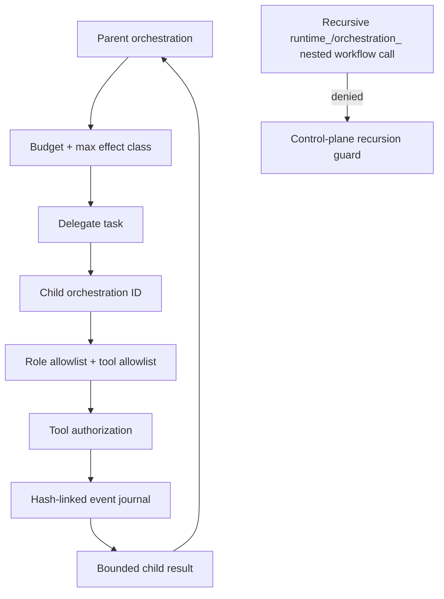
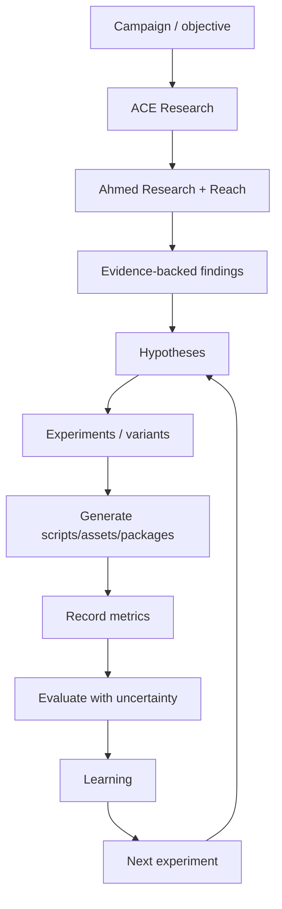
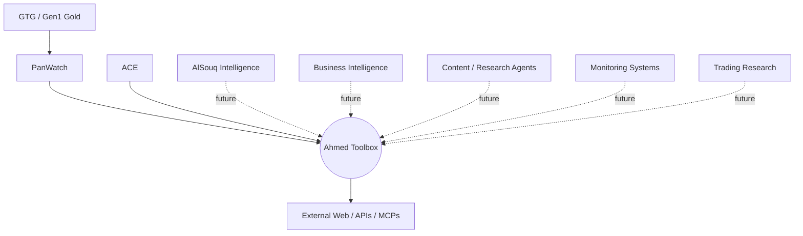

# Ahmed Toolbox Architecture Diagrams

> هذه الرسومات هي المصدر المرجعي Mermaid للخرائط المستخدمة في وثيقة Ahmed Toolbox. تم اشتقاقها من البنية التي تم التحقق منها في `ahs1233/Agent-Reach` على الفرع `feat/ahmed-toolbox-mcp` عند HEAD `14d42a09a1a47607e2224f11e026a694d6aa7344`، مع ملاحظة أن حالة GitHub قد تتغير بعد إنشاء هذا الملف.

## D1 - High-Level Architecture



## D2 - Master Mental Map



## D3 - Request Execution Flow



## D4 - Research Flow

```mermaid
flowchart LR
  Q[Question] --> R[Research Run]
  R --> S[Source discovery]
  S --> A[Acquisition events]
  A --> E[Evidence items]
  E --> C[Claims]
  C --> P[Provenance links]
  P --> F[Freshness + source independence]
  F --> T[Temporal validity / fusion]
  T --> O[Output fragments]
  O --> AU[Output audit + run audit]
  AU --> X[Exportable ledger / synthesis]
```



## D5 - Authentication Flow



## D6 - Failure & Recovery Flow



## D7 - Memory & Skill Flow



## D8 - Orchestration / Delegation Safety



## D9 - PanWatch Integration

```mermaid
flowchart LR
  P[PanWatch] --> C[AhmedToolboxClient]
  C --> R[Durable refresh credential]
  R --> A[/auth/token]
  A --> AT[Short-lived access token]
  AT --> M[/mcp]
  M --> RT[Ahmed Runtime / Reach / Research]
  RT --> E[Evidence / context]
  E --> P
  C -->|401| RR[Invalidate access + refresh + retry]
  C -->|transport error| TR[Replace HTTP client + retry]
  RR --> M
  TR --> M
```

## D10 - ACE Integration



## D11 - Ecosystem



## D12 - Production Reliability Loop

```mermaid
flowchart LR
  G[Git commit] --> CI[Focused + regression CI]
  CI -->|pass| DEP[Railway deploy]
  DEP --> HC[/health]
  HC --> BR[Chromium/CDP smoke]
  BR --> RA[Runtime startup acceptance]
  RA --> DT[Dual-temporal acceptance]
  DT --> LIVE[Live-network acceptance]
  LIVE --> OBS[Logs / execution stats / doctor]
  OBS --> FIX[Regression fix]
  FIX --> G
```